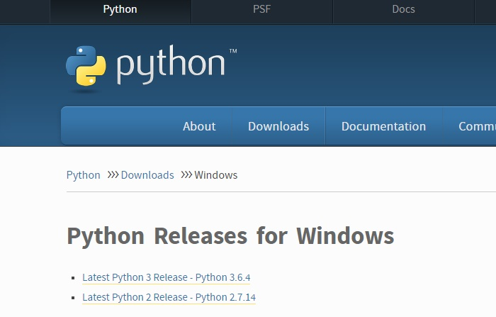

# RastreGranTor
This project pretends to build a powerful scolarships & grants search tool, it's based on the parsing of different websites, extracting the useful information.

# How To Use It?
It's all easy! All you have to do is downloading this whole directory, with all the scripts, the beautifulsoup file (it's a library) AND the 'max.txt' file, having python installed on your computer, and run genericScript.py script (what a redundance!).

If you don't know how to have python installed on your computer or how to run the script, don't panic!, you can check the little tutorial that can be found after the "Feed Me More!" section

Then, the script will start having babies! Little exit_N.txt files (where N is a number). Each file is the information extracted from a website, so you can check it confortably.

# Feed Me More!
You can also help building this tool by adding webparsers... In order to do that, you will need a bit of python scripting abilities, as well as some webparsing knowledge. If you have got all that and a really big heart, you can make the RastreGranTor grew better, faster and stronger like it was Kanye West.

How? You can script parsers and upload them to this repository, named as scrapperN.py, where N is the number that you can find in the 'max.txt' file. When you have already uploaded the code, you can just change that N number to the next one (N+1) inside the 'max.txt' file and your job will be done!

It's amazing, isn't it?

# Little Python Installing and Running Tutorial

You can start visiting the [Python for Windows download page](https://www.python.org/downloads/windows/). Right at the top, square and center, the repository asks if you want the latest release of Python 2 or Python 3. And, for you to know, you want the latest release of Python 3. So click there.

You will get to a screen with a lot of instructions and, if you scroll down you are going to find this chart:

Click on "Windows x86-64 executable installer" if your computer is a 64-bit Windows, and on "Windows x86 executable installer" otherwise. You will download the installer. Run it.

On the first screen, enable the “Add Python 3.6 to PATH” option and then click “Install Now.”

Next, you have a decision to make. Clicking the “Disable path length limit” option removes the limitation on the MAX_PATH variable. This change won’t break anything, but will allow Python to use long path names. Since many Python programmers are working in Linux and other *nix systems where path name length isn’t an issue, turning this on in advance can help smooth over any path-related issues you might have while working in Windows. For the RastreGranTor to work, this is not necessary, so, if you aren't sure if you want to disable this limit, you can click "Close" to finish the installation.

Perfect, you have now installed python. It's only left to run the script. To do that, right-click the genericScript.py file, and select "Open With..." and, in the submenu, select "Python".

That's it!